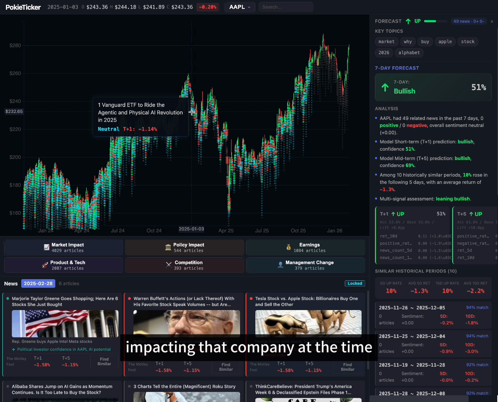

# PokieTicker — A股智能分析平台

**新闻驱动的A股分析工具**：自动爬取个股新闻，AI 情感分析，机器学习预测走势。



## 功能

- **K线图 + 新闻粒子** — 每个交易日下方的彩色圆点代表当日新闻，绿色=利好，红色=利空，点击查看详情
- **新闻分类筛选** — 按市场影响、政策影响、财报业绩、产品技术、市场竞争、管理层变动分类过滤
- **AI 趋势预测** — 基于近 7/30 天新闻情感 + 技术指标，XGBoost 模型预测 T+1/T+3/T+5 涨跌方向
- **历史相似匹配** — 余弦相似度查找历史上相似的新闻模式，参考后续走势
- **区间分析** — 选择日期范围，AI 解释为什么涨/跌
- **AI 深度分析** — 单篇新闻的上涨/下跌因素分析（DeepSeek API）
- **自动数据采集** — 搜索选中股票后自动爬取历史行情和新闻，训练模型时数据不足自动补充

## 技术架构

```
前端 (React + Vite + D3.js)                后端 (FastAPI + MySQL)
+----------------------------------+      +--------------------------------+
|  CandlestickChart (D3.js K线图)  |      |  Tushare Pro  → OHLC 日线数据  |
|  +- 新闻粒子叠加显示             |----->|  东方财富 API → 个股新闻       |
|  +- 十字准线 + 点击锁定          |      |                                |
|                                   |      |  Pipeline:                     |
|  NewsPanel (新闻面板)             |<-----|  Layer0 规则过滤               |
|  +- 情感排序                      |      |  Layer1 AI情感分析 (DeepSeek)  |
|  +- 涨跌原因                      |      |  Layer2 深度分析 (按需)        |
|                                   |      |                                |
|  PredictionPanel (预测面板)       |<-----|  XGBoost 预测模型              |
|  +- 7天 & 30天预测                |      |  +- 31维特征 (新闻+技术)       |
|  +- 相似历史周期                  |      |  +- 余弦相似度匹配             |
+----------------------------------+      +--------------------------------+
```

## 数据管道

```
搜索选中股票
  ├── Tushare Pro → OHLC日线数据 → ohlc表
  ├── 东方财富API → 个股新闻 → news_raw表
  ├── 新闻对齐 → news_aligned表 (计算T+0/1/3/5/10收益率)
  ├── Layer0 规则过滤 (去除垃圾/无关新闻)
  ├── Layer1 AI分析 (情感、相关性、涨跌原因)
  └── XGBoost模型自动训练 (数据充足时)
```

## 快速开始

### 1. 环境准备

- Python 3.10+
- Node.js 18+
- MySQL 8.0+

### 2. 数据库初始化

```bash
mysql -u root -p < init.sql
```

### 3. 配置文件

```bash
cp config.yml.example config.yml
# 编辑 config.yml，填入你的 API 密钥
```

| 配置项 | 获取地址 | 费用 |
|--------|----------|------|
| Tushare Token | [tushare.pro](https://tushare.pro/register) | 免费 |
| DeepSeek API Key | [platform.deepseek.com](https://platform.deepseek.com/) | 按量付费 |
| MySQL | 本地安装 | 免费 |

### 4. 安装依赖

```bash
# 后端
python -m venv venv
source venv/bin/activate   # Windows: venv\Scripts\activate
pip install -r requirements.txt

# 前端
cd frontend && npm install && cd ..
```

### 5. 启动服务

```bash
# 终端1: 后端
source venv/bin/activate
uvicorn backend.api.main:app --reload

# 终端2: 前端
cd frontend && npm run dev
```

打开 **http://localhost:5173** 即可使用。

## 使用流程

1. **搜索股票** — 输入代码或名称（如 `000001` 或 `平安银行`），选中后自动爬取数据
2. **等待数据加载** — 首次选择需要几秒钟获取历史行情和新闻
3. **查看K线图** — 鼠标悬停查看每日 OHLC，点击新闻圆点查看详情
4. **训练模型** — 点击预测面板的"训练模型"按钮，数据不足时自动补充
5. **AI分析** — 选择日期范围询问涨跌原因，或对单篇新闻进行深度分析

## 预测模型

**特征工程 (31维)：**
- **新闻特征** — 文章数、情感得分、正/负面比例、3/5/10日滚动均值、情感动量
- **技术指标** — 收益率(1/3/5/10日)、波动率、量比、RSI-14、MA交叉
- **市场情绪** — 全市场情感指标

**训练方式：**
- 扩展窗口交叉验证（避免未来数据泄露）
- 自动选择最优阈值
- 支持 XGBoost 和 LSTM 两种模型

## 项目结构

```
config.yml                        # 配置文件（API密钥，gitignored）
init.sql                          # MySQL 建表脚本
requirements.txt                  # Python 依赖

backend/
  config.py                       # pydantic-settings，加载 config.yml
  database.py                     # MySQL 连接管理
  tushare/
    client.py                     # Tushare行情 + 东方财富新闻接口
  sina/
    crawler.py                    # 新浪财经爬虫（备用）
  pipeline/
    layer0.py                     # 规则过滤
    layer1.py                     # AI情感分析（DeepSeek）
    layer2.py                     # 深度分析（按需）
    alignment.py                  # 新闻→交易日对齐 + 收益率计算
    similarity.py                 # 相似模式匹配
  ml/
    features.py                   # 特征工程（31维）
    model.py                      # XGBoost 训练与预测
    inference.py                  # 预测生成 + 相似周期分析
    lstm_model.py                 # LSTM 序列模型
  api/
    main.py                       # FastAPI 应用
    routers/
      stocks.py                   # 股票搜索、OHLC数据
      news.py                     # 新闻查询、分类、时间线
      analysis.py                 # AI深度分析
      pipeline.py                 # 数据抓取、处理、训练
      predict.py                  # 预测接口

frontend/
  src/
    App.tsx                       # 主布局
    components/
      CandlestickChart.tsx        # D3.js K线图 + 新闻粒子
      NewsPanel.tsx               # 新闻面板
      NewsCategoryPanel.tsx       # 分类筛选
      PredictionPanel.tsx         # AI预测面板
      RangeQueryPopup.tsx         # 区间分析弹窗
      SimilarDaysPanel.tsx        # 相似日匹配
      StockSelector.tsx           # 股票搜索
```

## 数据来源

| 数据 | 来源 | 说明 |
|------|------|------|
| A股日线行情 | Tushare Pro | 免费，需注册获取 Token |
| 个股新闻 | 东方财富 | 免费，无需 Token |
| AI情感分析 | DeepSeek | OpenAI 兼容接口，按量付费 |

## License

MIT — see [LICENSE](LICENSE) for details.
